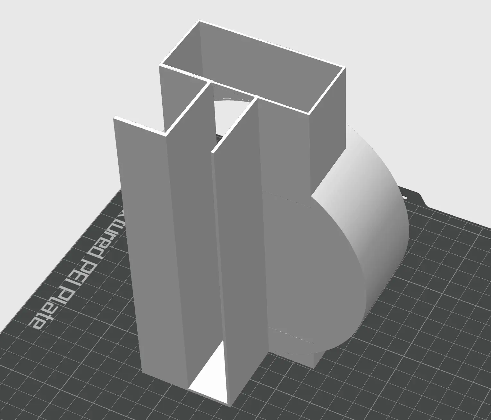
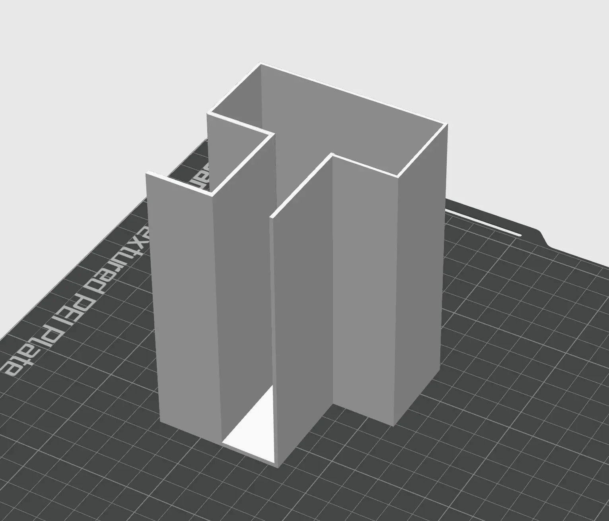
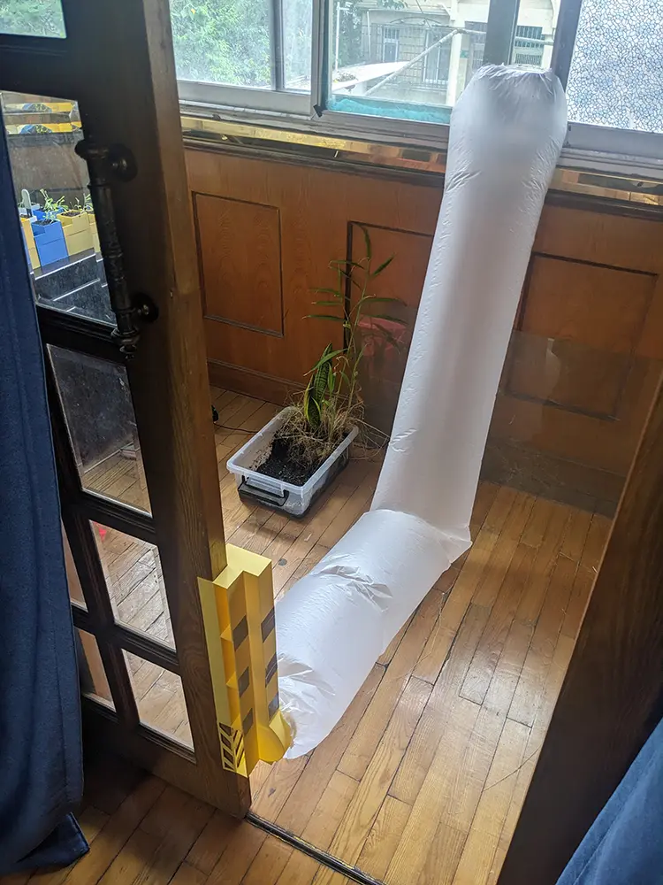
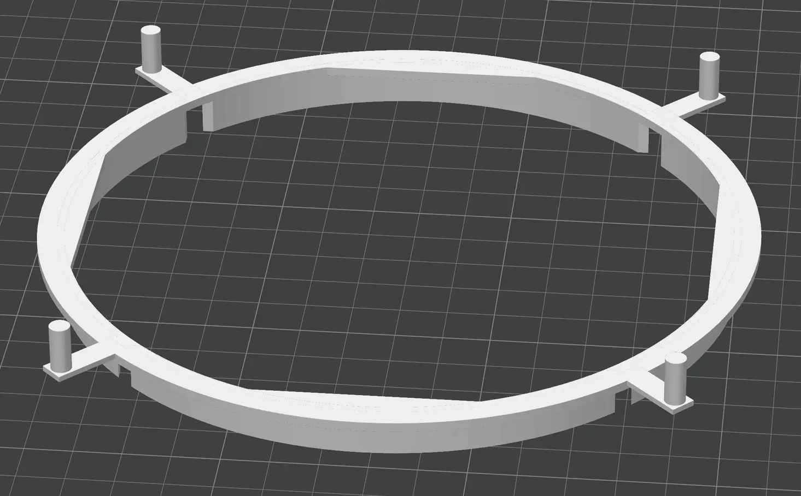
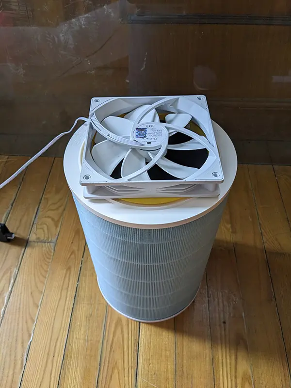
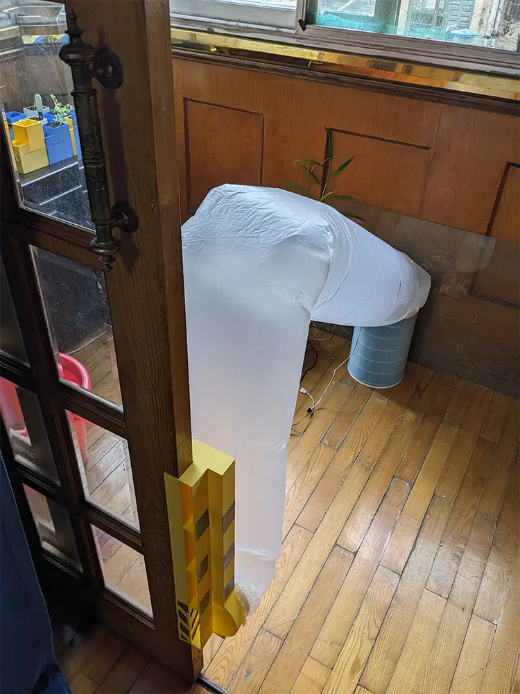

# 新风机！

大家知道吗，2氧化碳浓度过高会让人神智不清，也就是说，宿舍里的2氧化碳太多是导致舍友变成傻逼的主要原因！

但是给房间开窗通风的话，会很吵。安装普通的新风机的话，很贵，也不太好自己给墙打洞。怎么办呢？

好在聪明的莉沫酱发明了小型新风机，可以通过窗户和门的缝输送空气，这样就可以治好舍友啦！

## 模型

需要准备的材料是这些——

- 3D打印机
- 机箱用的14cm风扇
- 很长的塑料袋 (可选)
- 空气净化器的滤芯 (可选)

__底座__

模型有2个部分，底座是这样的——

后面的那个圆形的部分是用来接14cm风扇的，然后左边的凹槽可以用来固定在门上(要根据自己的门的厚度调整1下槽的大小)。

__延长管道__

另1个组件是延长出气管。由于门缝太小，出气很慢，所以可以加上这个来利用门缝的高度增加出气效率。

这个打印出来以后就直接用胶带粘在底座上，可以向上无限叠加，我自己测试下来发现到叠加3个是效果比较好的。

最终打印出来安装在门上，效果是这样: 

因为我很怕噪音，所以用了1个很长的塑料袋把进气风扇延长到了阳台上，这样风扇转速开得很高也不会吵到我了。

可以直接买现成的空调出风口用的塑料袋，像是淘宝上有卖[这个](https://item.taobao.com/item.htm?id=679252832444)。

__过滤装置__

有些地方的空气污染比较厉害，这样的话直接吸阳台的空气也不是很安全，需要先过滤1下。

所以我还做了1个14cm风扇和米家滤芯的固定器，这样1来只要把进风风扇和滤芯接在1起，送进来的空气就是净化后的了。不过其实不是很有必要，直接用胶带粘上去也是1样的。

然后米家滤芯可以在京东的[这里](https://item.jd.com/100030002130.html)买到(这个滤芯居然是材料里最贵的)。

把风扇和滤芯组合起来之后是这样——

最后再用前面说的塑料袋，把风扇过滤器和进气口接在一起以后，完全体是这样——

感觉很像商场的充气拱门！

## 结束

就这样，我要去给舍友人工呼吸了，大家88！
